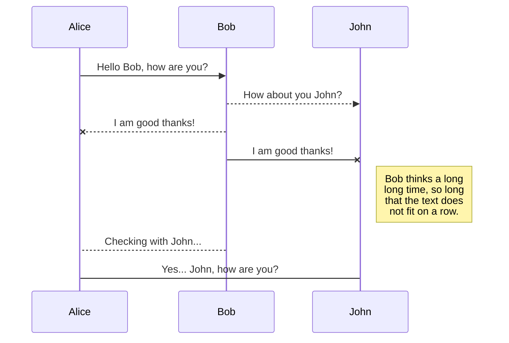

# Dotfiles: Best way to store in a bare git repository

_Disclaimer: the title is slightly hyperbolic, there are other proven solutions to the problem. I do think the technique below is very elegant   
# Dotfiles: Best way to store in a bare git repository  
  

_Disclaimer: the title is slightly hyperbolic, there are other proven solutions to the problem. I do think the technique below is very elegant though._  
  

Recently I read about this amazing technique in an [Hacker News thread](https://news.ycombinator.com/item?id=11070797) on people's solutions to store their [dotfiles](https://en.wikipedia.org/wiki/Dot-file). User `StreakyCobra`  [showed his elegant setup](https://news.ycombinator.com/item?id=11071754) and ... It made so much sense! I am in the process of switching my own system to the same technique. The only pre-requisite is to install [Git](https://www.atlassian.com/git).  
  

In his words the technique below requires:  
  

No extra tooling, no symlinks, files are tracked on a version control system, you can use different branches for different computers, you can replicate you configuration easily on new installation.  
  

The technique consists in storing a [Git bare repository](http://www.saintsjd.com/2011/01/what-is-a-bare-git-repository/) in a "_side_" folder (like `$HOME/.cfg` or `$HOME/.myconfig`) using a specially crafted alias so that commands are run against that repository and not the usual `.git` local folder, which would interfere with any other Git repositories around.  
  
  

# Files  
  

StackEdit stores your files in your browser, which means all your files are automatically saved locally and are accessible **offline!**  
  

## Create files and folders  
  

The file explorer is accessible using the button in left corner of the navigation bar. You can create a new file by clicking the **New file** button in the file explorer. You can also create folders by clicking the **New folder** button.  
  

## Switch to another file  
  

All your files and folders are presented as a tree in the file explorer. You can switch from one to another by clicking a file in the tree.  
  

## Rename a file  
  

You can rename the current file by clicking the file name in the navigation bar or by clicking the **Rename** button in the file explorer.  
  

## Delete a file  
  

You can delete the current file by clicking the **Remove** button in the file explorer. The file will be moved into the **Trash** folder and automatically deleted after 7 days of inactivity.  
  

## Export a file  
  

You can export the current file by clicking **Export to disk** in the menu. You can choose to export the file as plain Markdown, as HTML using a Handlebars template or as a PDF.  
  
  

# Synchronization  
  

Synchronization is one of the biggest features of StackEdit. It enables you to synchronize any file in your workspace with other files stored in your **Google Drive**, your **Dropbox** and your **GitHub** accounts. This allows you to keep writing on other devices, collaborate with people you share the file with, integrate easily into your workflow... The synchronization mechanism takes place every minute in the background, downloading, merging, and uploading file modifications.  
  

There are two types of synchronization and they can complement each other:  
  

- The workspace synchronization will sync all your files, folders and settings automatically. This will allow you to fetch your workspace on any other device.  
 > To start syncing your workspace, just sign in with Google in the menu.  
  
- The file synchronization will keep one file of the workspace synced with one or multiple files in **Google Drive**, **Dropbox** or **GitHub**.  
 > Before starting to sync files, you must link an account in the **Synchronize** sub-menu.  
  

## Open a file  
  

You can open a file from **Google Drive**, **Dropbox** or **GitHub** by opening the **Synchronize** sub-menu and clicking **Open from**. Once opened in the workspace, any modification in the file will be automatically synced.  
  

## Save a file  
  

You can save any file of the workspace to **Google Drive**, **Dropbox** or **GitHub** by opening the **Synchronize** sub-menu and clicking **Save on**. Even if a file in the workspace is already synced, you can save it to another location. StackEdit can sync one file with multiple locations and accounts.  
  

## Synchronize a file  
  

Once your file is linked to a synchronized location, StackEdit will periodically synchronize it by downloading/uploading any modification. A merge will be performed if necessary and conflicts will be resolved.  
  

If you just have modified your file and you want to force syncing, click the **Synchronize now** button in the navigation bar.  
  

>  **Note:** The **Synchronize now** button is disabled if you have no file to synchronize.  
  

## Manage file synchronization  
  

Since one file can be synced with multiple locations, you can list and manage synchronized locations by clicking **File synchronization** in the **Synchronize** sub-menu. This allows you to list and remove synchronized locations that are linked to your file.  
  
  

# Publication  
  

Publishing in StackEdit makes it simple for you to publish online your files. Once you're happy with a file, you can publish it to different hosting platforms like **Blogger**, **Dropbox**, **Gist**, **GitHub**, **Google Drive**, **WordPress** and **Zendesk**. With [Handlebars templates](http://handlebarsjs.com/), you have full control over what you export.  
  

> Before starting to publish, you must link an account in the **Publish** sub-menu.  
  

## Publish a File  
  

You can publish your file by opening the **Publish** sub-menu and by clicking **Publish to**. For some locations, you can choose between the following formats:  
  

- Markdown: publish the Markdown text on a website that can interpret it (**GitHub** for instance),  
- HTML: publish the file converted to HTML via a Handlebars template (on a blog for example).  
  

## Update a publication  
  

After publishing, StackEdit keeps your file linked to that publication which makes it easy for you to re-publish it. Once you have modified your file and you want to update your publication, click on the **Publish now** button in the navigation bar.  
  

>  **Note:** The **Publish now** button is disabled if your file has not been published yet.  
  

## Manage file publication  
  

Since one file can be published to multiple locations, you can list and manage publish locations by clicking **File publication** in the **Publish** sub-menu. This allows you to list and remove publication locations that are linked to your file.  
  
  

# Markdown extensions  
  

StackEdit extends the standard Markdown syntax by adding extra **Markdown extensions**, providing you with some nice features.  
  

>  **ProTip:** You can disable any **Markdown extension** in the **File properties** dialog.  
  
  

## SmartyPants  
  

SmartyPants converts ASCII punctuation characters into "smart" typographic punctuation HTML entities. For example:  
  

|  |ASCII |HTML |  
|----------------|-------------------------------|-----------------------------|  
|Single backticks|`'Isn't this fun?'`  |'Isn't this fun?' |  
|Quotes |`"Isn't this fun?"`  |"Isn't this fun?" |  
|Dashes |`-- is en-dash, --- is em-dash`|-- is en-dash, --- is em-dash|  
  
  

## KaTeX  
  

You can render LaTeX mathematical expressions using [KaTeX](https://khan.github.io/KaTeX/):  
  

The *Gamma function* satisfying $\Gamma(n) = (n-1)!\quad\forall n\in\mathbb N$ is via the Euler integral  
  

$$  
\Gamma(z) = \int_0^\infty t^{z-1}e^{-t}dt\,.  
$$  
  

> You can find more information about **LaTeX** mathematical expressions [here](http://meta.math.stackexchange.com/questions/5020/mathjax-basic-tutorial-and-quick-reference).  
  
  

## UML diagrams  
  

You can render UML diagrams using [Mermaid](https://mermaidjs.github.io/). For example, this will produce a sequence diagram:  
  


  

And this will produce a flow chart:  
  

```mermaid  
graph LR  
A[Square Rect] -- Link text --> B((Circle))  
A --> C(Round Rect)  
B --> D{Rhombus}  
C --> D  
```though._

Recently I read about this amazing technique in an [Hacker News thread](https://news.ycombinator.com/item?id=11070797) on people's solutions to store their [dotfiles](https://en.wikipedia.org/wiki/Dot-file). User `StreakyCobra` [showed his elegant setup](https://news.ycombinator.com/item?id=11071754) and ... It made so much sense! I am in the process of switching my own system to the same technique. The only pre-requisite is to install [Git](https://www.atlassian.com/git).

In his words the technique below requires:

No extra tooling, no symlinks, files are tracked on a version control system, you can use different branches for different computers, you can replicate you configuration easily on new installation.

The technique consists in storing a [Git bare repository](http://www.saintsjd.com/2011/01/what-is-a-bare-git-repository/) in a "_side_" folder (like `$HOME/.cfg` or `$HOME/.myconfig`) using a specially crafted alias so that commands are run against that repository and not the usual `.git` local folder, which would interfere with any other Git repositories around.

----------

## Starting from scratch

----------

If you haven't been tracking your configurations in a Git repository before, you can start using this technique easily with these lines:

```bash
git init --bare $HOME/.cfg
alias config='/usr/bin/git --git-dir=$HOME/.cfg/ --work-tree=$HOME'
config config --local status.showUntrackedFiles no
echo "alias config='/usr/bin/git --git-dir=$HOME/.cfg/ --work-tree=$HOME'" >> $HOME/.bashrc
```

-   The first line creates a folder `~/.cfg` which is a [Git bare repository](http://www.saintsjd.com/2011/01/what-is-a-bare-git-repository/) that will track our files.
-   Then we create an alias `config` which we will use instead of the regular `git` when we want to interact with our configuration repository.
-   We set a flag - local to the repository - to hide files we are not explicitly tracking yet. This is so that when you type `config status` and other commands later, files you are not interested in tracking will not show up as `untracked`.
-   Also you can add the alias definition by hand to your `.bashrc` or use the the fourth line provided for convenience.

I packaged the above lines into a [snippet](https://bitbucket.org/snippets/nicolapaolucci/ergX9) up on Bitbucket and linked it from a short-url. So that you can set things up with:

```bash
curl -Lks http://bit.do/cfg-init | /bin/bash
```

After you've executed the setup any file within the `$HOME` folder can be versioned with normal commands, replacing `git` with your newly created `config` alias, like:

```bash
config status
config add .vimrc
config commit -m "Add vimrc"
config add .bashrc
config commit -m "Add bashrc"
config push
```

## Installing your dotfiles onto a new system (or migrate to this setup)

----------

If you already store your configuration/dotfiles in a [Git repository](https://www.atlassian.com/git), on a new system you can migrate to this setup with the following steps:

-   Prior to the installation make sure you have committed the alias to your `.bashrc` or `.zsh`:

```bash
alias config='/usr/bin/git --git-dir=$HOME/.cfg/ --work-tree=$HOME'
```

-   And that your source repository ignores the folder where you'll clone it, so that you don't create weird recursion problems:

```bash
echo ".cfg" >> .gitignore
```

-   Now clone your dotfiles into a [bare](http://www.saintsjd.com/2011/01/what-is-a-bare-git-repository/) repository in a "_dot_" folder of your `$HOME`:

```bash
git clone --bare <git-repo-url> $HOME/.cfg
```

-   Define the alias in the current shell scope:

```bash
alias config='/usr/bin/git --git-dir=$HOME/.cfg/ --work-tree=$HOME'
```

-   Checkout the actual content from the bare repository to your `$HOME`:

```undefined
config checkout
```

-   The step above might fail with a message like:

```js
error: The following untracked working tree files would be overwritten by checkout:
    .bashrc
    .gitignore
Please move or remove them before you can switch branches.
Aborting
```

This is because your `$HOME` folder might already have some stock configuration files which would be overwritten by Git. The solution is simple: back up the files if you care about them, remove them if you don't care. I provide you with a possible rough shortcut to move all the offending files automatically to a backup folder:

```bash
mkdir -p .config-backup && \
config checkout 2>&1 | egrep "\s+\." | awk {'print $1'} | \
xargs -I{} mv {} .config-backup/{}
```

-   Re-run the check out if you had problems:

```undefined
config checkout
```

-   Set the flag `showUntrackedFiles` to `no` on this specific (local) repository:

```bash
config config --local status.showUntrackedFiles no
```

-   You're done, from now on you can now type `config` commands to add and update your dotfiles:

```bash
config status
config add .vimrc
config commit -m "Add vimrc"
config add .bashrc
config commit -m "Add bashrc"
config push
```

Again as a shortcut not to have to remember all these steps on any new machine you want to setup, you can create a simple script, [store it as Bitbucket snippet](https://bitbucket.org/snippets/nicolapaolucci/7rE9K) like I did, [create a short url](http://bit.do/) for it and call it like this:

```bash
curl -Lks http://bit.do/cfg-install | /bin/bash
```

For completeness this is what I ended up with (tested on many freshly minted [Alpine Linux](http://www.alpinelinux.org/) containers to test it out):

```bash
git clone --bare https://bitbucket.org/durdn/cfg.git $HOME/.cfg
function config {
   /usr/bin/git --git-dir=$HOME/.cfg/ --work-tree=$HOME $@
}
mkdir -p .config-backup
config checkout
if [ $? = 0 ]; then
  echo "Checked out config.";
  else
    echo "Backing up pre-existing dot files.";
    config checkout 2>&1 | egrep "\s+\." | awk {'print $1'} | xargs -I{} mv {} .config-backup/{}
fi;
config checkout
config config status.showUntrackedFiles no
```

